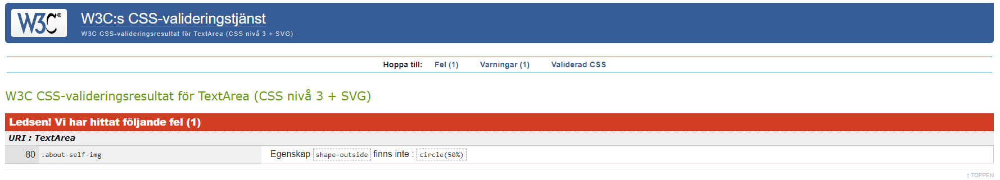

# *Elenore's photos*

[A live version of the page can be viewed here](https://mmmangooo.github.io/Milestone-Project1/)

 

This is a one page website for amateur photographer Elenore Henriksson. Its purpose is to show off her work to potential clients and others interested in seeing an example of her photos.
The entire page is responsive and customized for desktop, tablets and mobile phone. The design is largely focused on giving the viewer an immediate view of the quality of Elenore´s work and making it easy to take the step to get in touch with her.
Because this is a site aimed at private clients (B2C), the site is designed with the clients emotion-driven decision-making in mind. Therefore it contains a lot of images, which are in focus on all pages, and a rather simple but eye-catching design.

The business goals of this website is to:
* Attract potential clients 
* Show examples of the photographer's work to potential clients in a way that sparks an interest in hiring her
* Encourage potential clients to make contact with the photographer via easy accessible contact options on the site 
* Provide good UX to give potential clients a positive feeling and an impression of professionalism when visiting the site

The client goals of this website is to:
* Quickly gain an image of what the expected product (the photos) will look like if hiring Elenore for photography services
* Spark an interest in getting equally beautiful photos of self/children/other 
* Get an impression of what Elenore is like to work with, getting an image of her as a professional to make it easy for the client to make an informed decision about wanting to hire her
* Make it easy to get in touch with Elenore to discuss using her services

## UX

### Ideal client
#### The ideal client for this business is:
* Swedish speaking
* Living near Stockholm, Sweden
* Has disposable income
* Is probably a parent or is pregnant/has a pregnant partner

#### Visitors to this website are looking for:
* An example of good pregnancy photography or children photography
* A photographer to hire for taking photos of themselves or their children/partner

#### This project is the best way to help them achieve this because:
* It clearly shows off examples of photos in the above categories
* It has an emphasis on examples of Elenore's photography and therefore makes it easy to get an impression of what her work looks like
* It is designed with well known UX-rules in mind, such as the Z-design for the landing page
* It gives information about how Elenore works and what she thinks and acts like as a professional, which makes it easy for the client to decide if they want to hire her
* It makes it easy to make contact with Elenore as it guides them to the contact form from every page on the site

* User stories
    1. As a first time visitor I want to quickly get a feel for the quality of this photographer's work
    2. As a first time visitor I want to get a clear example of what pregnancy/children photography can look like
    3. As a first time visitor, I want to gain knowledge of this photographer as a professional and get a perception of her as a person  
    4. As a potential client, I want to see more photos of the type that I am interested in, eg pregnancy or children
    5. As an interested client, I want to quickly see how I can contact the photographer to discuss using her services
    6. As an interested client, I want a user-friendly contact form that is easy to fill in
    7. As an interested, potential client or an observer, I want to follow the photographer on social media so I can see more of her work and be updated on new work 
    8. As a returning visitor who has decided to get in touch with the photographer to discuss hiring her, I want to quickly access the contact page 

#### Design 

* Color scheme
The purpose of the colors chosen is to create good contrast for the reader, as well as making the site easy on the eyes an visually appealling.
 
- For body background and some headings, #fbfcf2 is used
- For some headings, footer icons and footer text and send button in contact form, #656d35 is used
- A dark orange contrast color, #c95512, is used for the call to action button 
- A slightly green dark grey hue, #72726c, is used for the paragraph text in About section

* Typography
The intention behind the fonts chosen is to create a personal, yet professional impression with good readability. The Raleway font in my opinion has a look of friendliness without being personal to the extent of giving an unprofessional impression. It halso has good redability due to clear separation of words and letters and is therefor suitable for longer texts, as well as for headlines. 
As for the H1 in the header, the purpose of the chosen font, Dancing Script, is to give an impression of creativity and personality as well as to be esthetically pleasing. 

* Imagery
    * The imagery is of great importance since the photos on the page are examples of the products that the site owner is selling 
    * The header images on the home page are chosen to be eye-striking and spark an interest in seeing more, and they are displayed in a carousel to make a more vivid impression and make possible to show more than one photo. 

#### Wireframe mockups:

[Link to wireframes:](./assets/docs/wireframes.pdf)

#### Differences to Design
When actually coding the site, some of the design choices I made turned out to be either complicated to achieve or creating bad UX. As there is not endless resources of time, and the developer is not yet very accomplished, some things in the design needed to be reconsidered.
* In the wireframes, the navbar is vertically aligned, which when actually building the web-site turned out to be a bit too complicated to code and also would take up too much space on the header on smaller screens, so this was changed to a horizontal navbar.
* The gallery page was originally meant to consist of two different sections, one for pregnancy photo and one for children. However this seemed unnecessarily cluttered when actually carried out on the screen and therefor was changed to just one gallery of mixed photos.
* The footer was originally meant to be fixed at the bottom and visible throughout the page. This was pointed out by the mentor as bad UX, and therefore altered to staying at the bottom of last page.
* The contact page was designed to have a round image on it along with the contact form. However this image turned out to clutter the contact page and hide the background image too much, so it was removed.
* The navbar and logo was originally intended to appear on top of carousel container, but this proved to create issues with readability. 
* Added customer quotes to contact section during development.

## Features

Every page contains a shortcut link to the contact page, in form of an icon in the down right corner. The purpose of this is to make it easy for the user to find and quickly get to the contact page regardless of where the user is on the page.
Each page also features a navigation bar on the top right, which is fixed in its position so it remains the same while the user scrolls down the page. The purppse of this is to make it easy no navigate the page no matter where on te page the user currently is. 
The navigation bar is collapsed to a "hamburger menu" on mobile and tablet. Each page contains a footer with copyright information and links to the photographer in social media.

### Home
The home page features a large hero image displayed in a carousel containing three photos. This carousel takes up the height of almost the entire screen on all devices and the purpose of this is to immediately catch the viewers attention and create a wow-feeling on watching the photos. 
These photos represent the photographers best work and are chosen to spark an interest in seeing more of her work. 
Overlaying the header-carousel is the "logo" (Elenores name) on the top left, and on the top right is the navigation bar. the puropse of this layout is to make sure the first thing the user sees after the beautiful photos is the photographer's name, as the viewer reads from left to right their eyes will seek the top left corner first after seeing the large photos.
The next thing that catches the viewer eyes is the navigation bar on the top right, which means they quickly will see how to navigate the site and possibly get to the gallery part where more images are displayed.
After the navigation bar, the next thing that will catch the viewer's eyes is the contact shortcut (call to action) on the down right, as the reader after seeing the first "line" (top left to top right) will move it eyes downwards to the bottom "line", where they move from legft to right to meet the contact shortcut.
This pattern follows the Z-model of design which is based on the facts of reading from left to right explained above.

### About
The about page features a text about Elenore to the left, wrapped around a self-portrait of her to the right. On mobile device, the image of Elenore is placed above the text.
The text contains information about how Elenore thinks about photography, how she works and a little about her interests and who she is as a person. 
Further to the right is a few photos in circle-shape as well, representing important work and connected to whats mentioned in the text.
The pattern of this page also follows the left to right-reading model so that the first thing the viewer will see is the personal information about Elenore and her picture, which is aimed to create an interest and feeling of connection on a personal level.
On mobile and tablet, the pictures to the right of the info text and image of Elenore will not be present as it would have become to cluttered. 

### Gallery
The gallery page contains a masonry gallery with photos layed out in four columns on desktop, three columns on tablet and two columns on mobile device. The gallery contains fewer images on mobile device and the images chosen to be viewed on mobile are representantive for different types of photography, such as children or pregnancy respectively.
This pages contains nothing but a heading and the photo gallery, to keep the viewer's attention on the photos. Although the footer and call to action button on the down right are present as on all pages.

### Contact
The contact page features a contact form on the left and customer-quotes on the right. On tablet and mobile device, the customer quotes are placed below the content form and both the forms and is the quotes are center aligned. On mobile there is only one quote displayed.
Behind the text is a background image whith some opacity to create a somewhat dreamy effect, and there is also a black overlay on the background made to improve visibility of the light colored text.  

### Features to implement in the future
A pricing page will be implemented when the photographer have started up her business and made research into what pricing level is right for her potential clients. 

## Technologies used
* This project uses HTML and CSS programming languages
* [GitPod](https://www.gitpod.io/) - The developer used GitPod for their IDE while building the website
* [GitHub](http://github.com) - This project uses GitHub to store the projects code after being pushed from Git.
* [Git](https://git-scm.com/) - The project uses Git for version control by utilizing the Gitpod terminal to commit to Git and Push to GitHub.
* [BootstrapCDN](https://getbootstrap.com/) - The project uses Bootstrap for simplified process of structuring the website, facilitate in making it responsive and for adding certain elements. It also uses Bootstrap to provide javascript needed for the carousel and the nav bar.
* [Google Fonts](https://fonts.google.com/) - The project uses Google Fonts for styling fonts.
* [Font Awesome](https://fontawesome.com/) - The project uses Font Awesome for icons.
* [Balsamiq](https://balsamiq.com/) - This project uses Balsamiq for creating the wireframes during the design process.
* [Material Color tool](https://material.io/resources/color/#!/?view.left=0&view.right=0) - This project uses Material's color tool for choosing colors and creating a color scheme.
* [ResizeImage.net](https://resizeimage.net/) - The project have used this site for resizing images to smaller size.
* [Tiny PNG](https://tinypng.com/) - The project have used this site for compressing images.

## Testing

The page has been manually tested on the functionality of the following:
* Links in the navigation bar
* Link in CTA-button
* Animation on hover over CTA-button
* Functionality of contact form - field requirement and send button 
* External links functioning and opening in new browser

### Testing User Stories from User Experience (UX) Section

* First time visitor
    1. As a first time visitor I want to quickly get a feel for the quality of this photographer's work
        - The landing page consists mainly of a large image carousel displaying some of the photographer´s best work, which makes this the first thing the visitor sees.
        - The navigation bar is clearly visible on the top right, making the path to image gallery easy to find and quick to access.
    2. As a first time visitor I want to get a clear example of what pregnancy/children/family photo can look like
        - An example of pregnancy/children/family photo is shown in the large image carousel on landing page
        - More examples are easily accessible through the navigation bar on top left corner of landing page.
    3. As a first time visitor, I want to gain knowledge of this photographer as a professional and get a perception of her as a person 
        - The about section offers information about how the photographer thinks about photography services and how she acts as a professional.
* Potential client
    1. As a potential client, I want to see more photos of the type that I am interested in, eg pregnancy or children
        - A wider example of photos are shown in the gallery section.
* Interested client
    1. As an interested client, I want to quickly see how I can contact the photographer to discuss using her service
        - The navigation bar that is clearly visible on the top right of the landing page, and through all pages, contains a link to contact page, making it easily accessible.
        - The call to action button in the down right corner of all pages has a bright color that catches the eye and provides a shortcut to contact page.
    2. As an interested client, I want a user-friendly contact form that is easy to fill in
        - The contact form has a simple styling and clear visibility to make it easy to understand and quick to fill in.
    3. As an interest potential client or an observer, I want to follow the photographer on social media so I can see more of her work and be updated on new work 
        - Links to social media pages are clearly visible in the footer on the last page.
* Returning visitor
    1. As a returning visitor who has decided to get in touch with the photographer to discuss hiring her, I want to quickly access the contact page 
        - The navigation bar that is clearly visible on the top right of the landing page, and through all pages, contains a link to contact page, making it easily accessible.
        - The call to action button in the down right corner of all pages has a bright color that catches the eye and provides a shortcut to contact page.
        - The above shortcuts to contact page provided on the site makes it easy for a returning visitor to quickly get to the contact page without viewing the entire site again.

 

### Further Testing
* The HTML code has been validated through [W3 Markup Validation Service](https://validator.w3.org/) and showed no errors.
* The CSS code has been validated thorugh [W3 CSS Validation Service, Jigsaw](https://jigsaw.w3.org/css-validator/) with the following error:

     - This error message was revised by mentor Akshat Garg and advised to ignore because of not effecting functionality.
* The page has been reviewed by fellow students in the Peer review channel on Slack
* The page has been reviewed by friends and family, who have looked at it on different mobile devices and commented on responsivity and user experience.

### Known bugs

#### During development
* Mobile responsiveness for about section not working as intended. The column with round images has display:none set for tablet and mobile devices, but still occupies space on the screen, thus preventing the column with about text and portrait of photographer from centering on the page.
    - Changed setting for about-col from col-sm-6 to col-12 col-lg-6 so that it takes up the entire width of the screen on mobile and tablet devices and 50% of the screen on large devices.
* Footer content showing up on contact background-container on mobile devices.
    - Set a fixed height to contact container.
* Unable to customize color of navbar links, seems like impossible to override the bootstrap set color.
    - Added !important to .nav-link color setting. 
* Poor visibility on contact section due to the black and white background image and light colored text. Changing the text color to a dark or bright color would have altered the intended design too much.
    - Solved by adding a dark overlay, which was suggested and teached by mentor Akshat Garg.
* Images are too large and takes time to load, even though they have been shrinked in size using [ResizeImage.net](https://resizeimage.net/)  and compressed using [Tiny PNG](https://tinypng.com/).
    - This problem remains to be solved.

#### During testing
* The first time the HTML code was run through [W3 Markup Validation Service](https://validator.w3.org/), several errors were found in the path to images used to sites. The errors consisted of blank spaces in the paths.
    - This problem was solved by renaming images.
* When this project was posted in Peer Code Review channel on slack, some fellow students discovered issues with a white line on the right of the screen on mobile devices, caused by the navbar taking up a wider space to the right than the rest of the content on page.
    - This problem was solved by adding class="container-fluid" to about-section, as it was this section that was causing the issue by adding a right-margin.

## Deployment
This website was developed on GitPod, using git and GitHub to host the repository.

### GitHub Pages
When deploying this website using GitHub Pages the following steps were made:

Opened up GitHub in the browser.
Signed in using username and password.
Selected my repositories.
Navigated to Milestone-Project1.
In the top navigation clicked settings.
Scrolled down to the GitHub Pages area.
Selected Master Branch from the Source dropdown menu.
Clicked to confirm my selection.
The website was now live on GitHub Pages.

### Making a Local Clone
Navigate to the GitHub repository: https://github.com/mmmangooo/Milestone-Project1.
Click the green Clone or Download button.
Copy the url in the dropdown box.
Using your favourite IDE open up your preferred terminal.
Navigate to your desired file location.
Use the 'git clone' command in terminal followed by the copied git URL
A clone of the project will be created locally on your machine

## Credits

### Content
* The content for the about page was created by Elenore Henriksson, with some editing by Isabelle Ängsås
* The content fot the rest of the website was created by Isabelle Ängsås

### Media
All images is taken by, and provided to the developer by, the photographer herself and are used with permission from the people appearing in the photos.

Social media icons are from Font Awesome -  [Font Awesome](https://fontawesome.com/) 

Camera Favicon is from [Favicon](https://favicon.io/)

### Code

Wrapping text shaped around circular image:
[CSS-tricks](https://css-tricks.com/almanac/properties/s/shape-outside/)

Making circular images keep their shape: 
[Stack Overflow](https://stackoverflow.com/questions/35336298/responsive-circular-images)

Making background-image transparent while elements on top remain non-transparent:
[CSS-tricks](https://css-tricks.com/non-transparent-elements-inside-transparent-elements/)

Making black and white background-image darker to improve light text visibility:
Mentor Akshat Garg

Making the CTA-button appear larger on hover on and smaller again on hover off, with transition:
[CSS-tricks](https://css-tricks.com/different-transitions-for-hover-on-hover-off/)

### Acknowledgements
* Thanks to fellow students on the slack channel for testing and support.
* Thanks to tutor support for helpful guidance with solving bugs.
* Thanks to mentor Akshat Garg for valuable input on design and UX and help with debugging technical issues.

